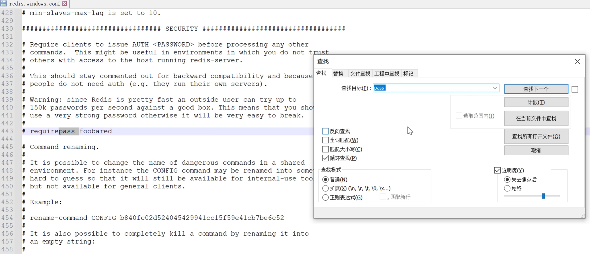
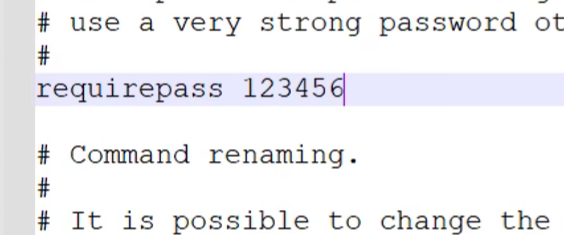
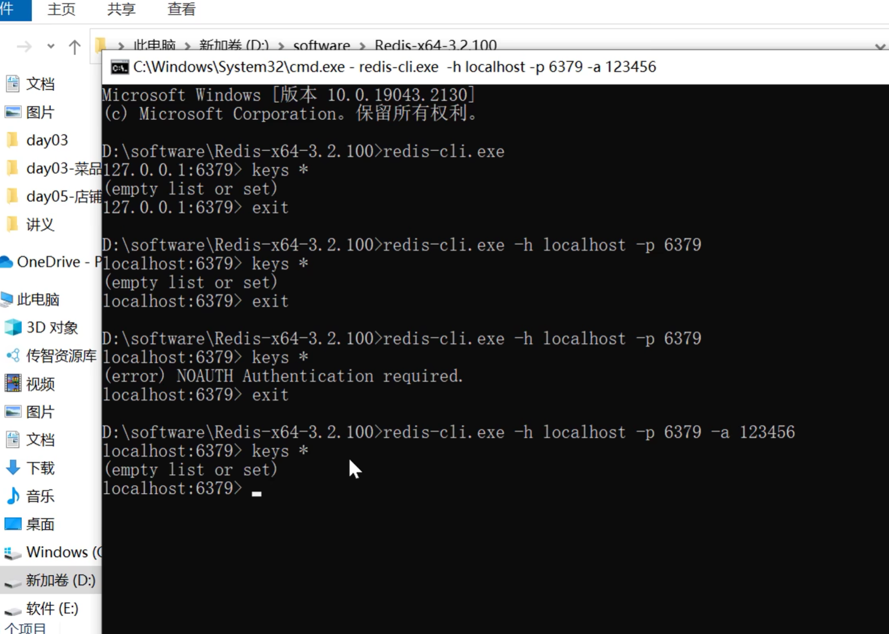

### 缺点

- 没有使用redis验证jwt的唯一性和安全性，凡是符合jwt规范的都能被该项目认证成功

- 应该使用mybatisplus的insert语句实现自动生成主键，该语句使用雪花算法生成主键，安全性更高，更便于拆分成微服务架构

  也可能是为了公共字段自动赋值才显式的写出来

  优化：可以加在service层

- 员工账号的启用和禁用应该在程序中根据旧值判断，通过取反的方式修改，而不是直接用前端传入的参数修改，这样安全性更高

- controller层没有定义api接口类，文档注释、接口文档注解没有统一集中在接口类中管理

- 部分controller返回值定义不规范，如CommonController的upload末尾return null;

### 优点

- 定义了大量的异常类，提示信息更加具体可靠

- 定义了大量的公共常量类，维护返回信息，而不是使用字符串硬编码

- maven分包，vo包作为响应数据

- 前端使用了反向代理，安全性更强，

- 使用aop+注解的方式实现对公共字段填充的自动赋值

- 实现了统一格式转换操作，再也不用使用@JsonFormat注解调整日期类型的返回格式了

### 笔记

- @RequestParam可以将前端传来的raw格式，string类型，结构为id1, id2, id3, ..., idn的参数自动转换为List<Long>，是SpringMVC的效果

- 前端传来的是params格式的参数，如果使用对象则不需要使用注解接收，逐个接收则必须使用@RequestParam注解

- 修改redis为需要密码登录的模式

  首先在config文件中查找pass将requirepass前的注释删除，并在后空格写上密码，保存后，redis将启用该密码

  redis没有用户概念，在客户端登录时，在后面空格拼接-a并直接提供密码就可以继续使用了

- 
